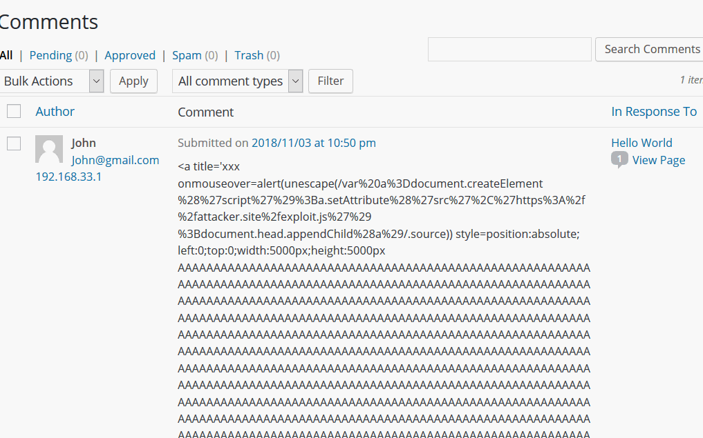
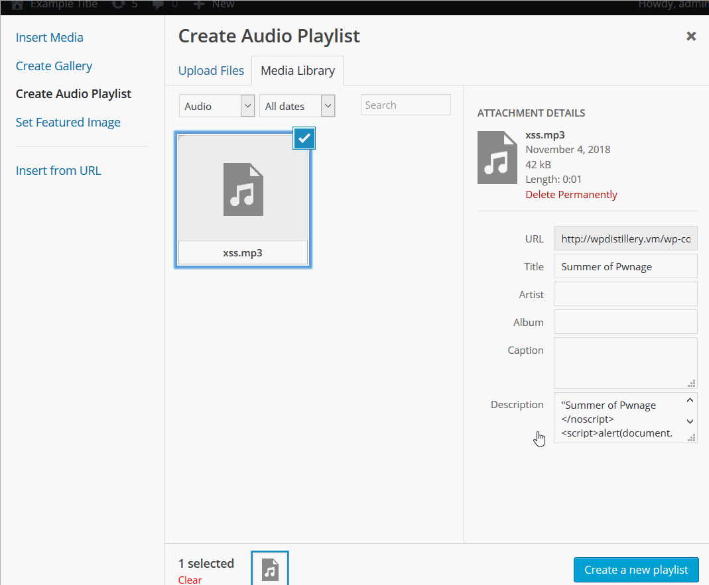
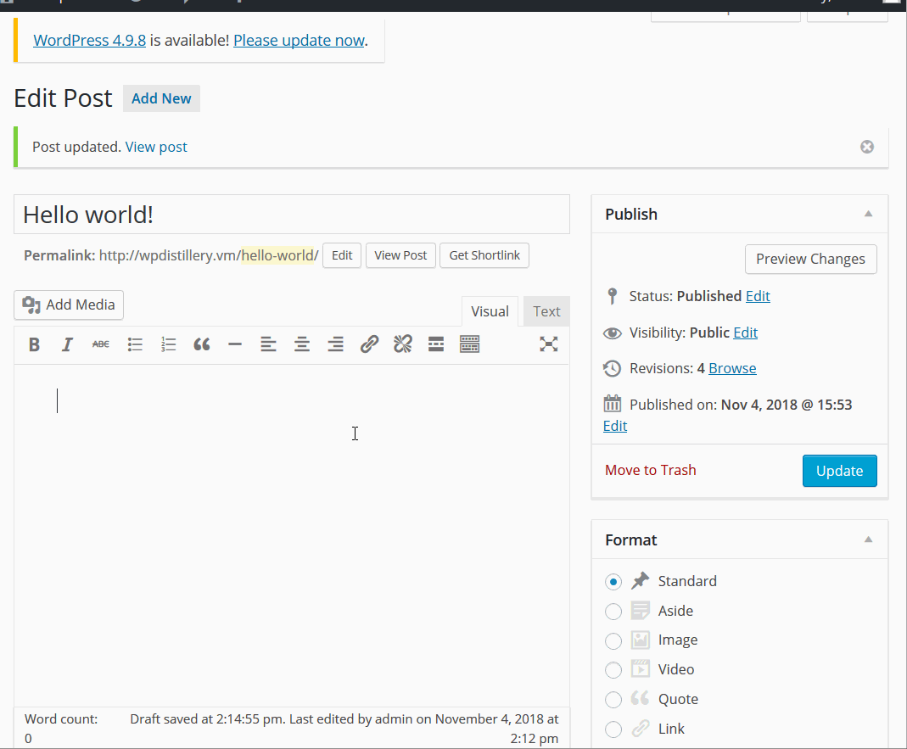
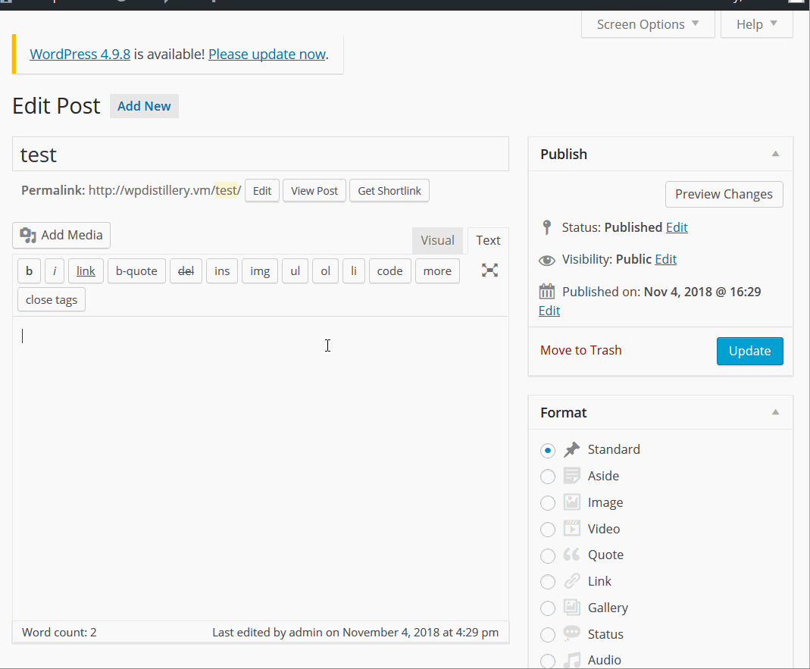
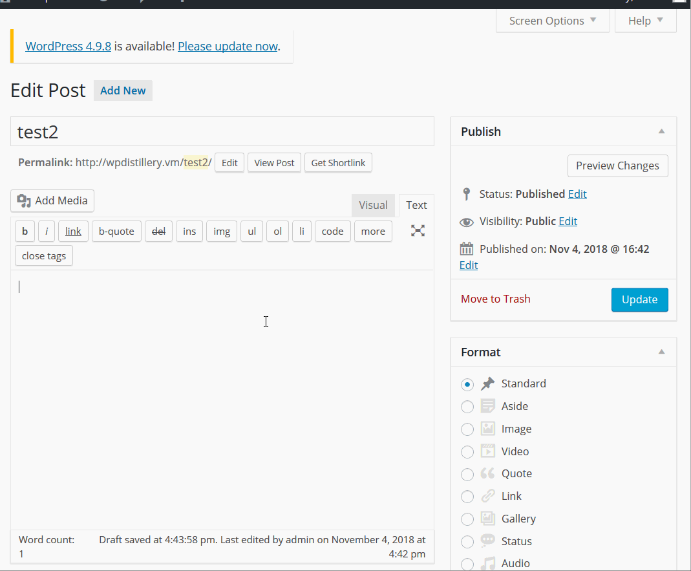

# Project 7 - WordPress Pentesting

Time spent: 5 hours spent in total

> Objective: Find, analyze, recreate, and document **five vulnerabilities** affecting an old version of WordPress

## Pentesting Report

1. (Required) Unauthenticated Stored Cross-Site Scripting(CVE-2015-3440)
  - [ ] Summary: 
    - Vulnerability types: XSS
    - Tested in version: 4.2
    - Fixed in version: 4.2.1
  - [ ] GIF Walkthrough:
  - [ ] Steps to recreate: 
     - Enter the comment text
     - Login as admin and approve the comment
     - go back to example site
  - [ ] Affected source code:
1. (Required) Authenticated Cross-Site Scripting via Media File Metadata(CVE-2017-6814)
  - [ ] Summary: 
    - Vulnerability types: XSS
    - Tested in version: 4.2
    - Fixed in version: 4.2.13
  - [ ] GIF Walkthrough:
  - [ ] Steps to recreate: 
    - login as admin 
    - upload MP3 file to the Media Library
    - create new post and add media from library
    - create audio playlist
    - choose the mp3 file and click create a new playlist
  - [ ] Affected source code:
    - [Link 1](https://build.trac.wordpress.org/browser/tags/4.2/wp-includes/media.php)
1. (Required) Authenticated Stored Cross-Site Scripting in YouTube URL Embeds(CVE-2017-6817)
  - [ ] Summary: 
    - Vulnerability types: XSS
    - Tested in version: 4.2
    - Fixed in version: 4.2.13
  - [ ] GIF Walkthrough: 
  - [ ] Steps to recreate: 
    - Edit a post
    - input "[embed src='https://youtube.com/embed/12345\x3csvg onload=alert(1)\x3e'][/embed]" as text
  - [ ] Affected source code:
    - [Link 1](https://github.com/WordPress/WordPress/commit/419c8d97ce8df7d5004ee0b566bc5e095f0a6ca8)
1. (Optional) Authenticated Stored Cross-Site Scripting(CVE-2015-5622)
  - [ ] Summary: 
    - Vulnerability types: XSS
    - Tested in version: 4.2
    - Fixed in version: 4.2.3
  - [ ] GIF Walkthrough: 
  - [ ] Steps to recreate: 
    - login as admin
    - create post named Test
    - change to Text mode and insert: <a href="[caption code=">]</a><a title=" onmouseover=alert('test')  ">link</a>
    - publish and view post
  - [ ] Affected source code:
    - [Link 1](https://build.trac.wordpress.org/browser/tags/4.2/wp-includes/shortcodes.php)
1. (Optional) Unauthenticated Genericons Cross-Site Scripting
  - [ ] Summary: 
    - Vulnerability types: XSS
    - Tested in version: 4.2 
    - Fixed in version: 4.2.2
  - [ ] GIF Walkthrough: 
  - [ ] Steps to recreate: 
    - create post named Test2
    - text = "http://www.example.com/wp-content/themes/twentyfifteen/genericons/example.html#1"
    - publish and view post
  - [ ] Affected source code:

## Assets

List any additional assets, such as scripts or files

## Resources

- [WordPress Source Browser](https://core.trac.wordpress.org/browser/)
- [WordPress Developer Reference](https://developer.wordpress.org/reference/)

GIFs created with [LiceCap](http://www.cockos.com/licecap/).

## Notes

Describe any challenges encountered while doing the work

## License

    Copyright [Xiaoyan Zhang] [thumb2267]

    Licensed under the Apache License, Version 2.0 (the "License");
    you may not use this file except in compliance with the License.
    You may obtain a copy of the License at

        http://www.apache.org/licenses/LICENSE-2.0

    Unless required by applicable law or agreed to in writing, software
    distributed under the License is distributed on an "AS IS" BASIS,
    WITHOUT WARRANTIES OR CONDITIONS OF ANY KIND, either express or implied.
    See the License for the specific language governing permissions and
    limitations under the License.
